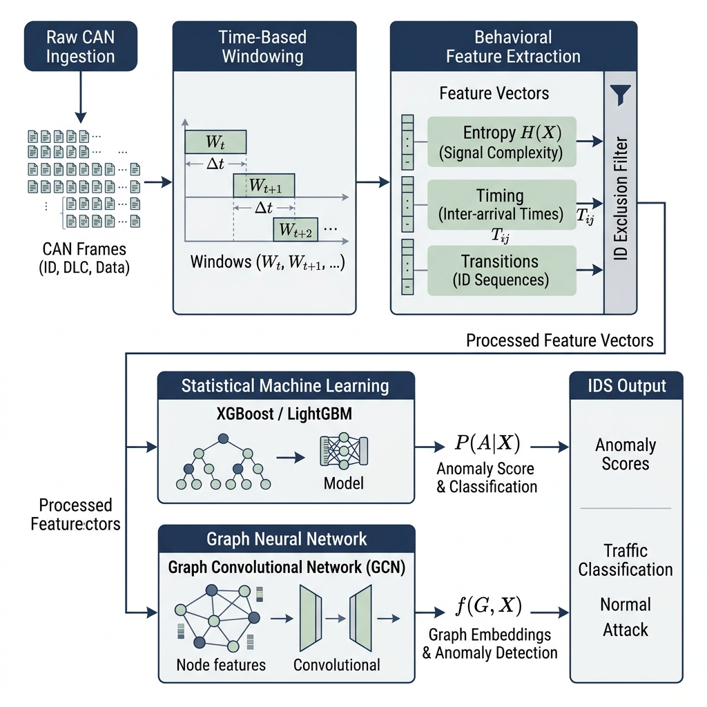
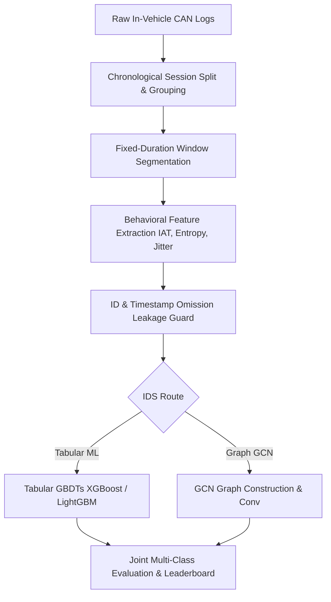

## Executive Summary
Chakravyuham is a machine learning–based Intrusion Detection System (IDS) designed to detect and classify malicious activity on in-vehicle Controller Area Network (CAN) bus systems. Modern vehicles consist of interconnected Electronic Control Units (ECUs) that communicate over CAN, a protocol that inherently lacks authentication and encryption, making it vulnerable to message injection, spoofing, and denial-of-service attacks. While existing automotive cybersecurity solutions rely heavily on rule-based detection systems, these approaches struggle to identify subtle behavioral attacks and do not generalize well across different vehicle architectures.

Our project addresses this gap by developing a behavior-driven IDS using Graph Neural Networks (GCNs) and Gradient Boosted Decision Trees (XGBoost and LightGBM), trained on real-world datasets such as the HCRL Car-Hacking and OTIDS datasets. Instead of relying on raw identifiers or dataset-specific shortcuts, our system learns communication patterns through engineered behavioral features such as inter-arrival time, entropy, transition dynamics, and graph topology representations of CAN message flows.

During development, we identified that conventional evaluation practices in IDS research often overestimate model performance due to dataset leakage and artifact memorization. This led us to redesign our training and evaluation pipeline with temporal splits, block-wise partitioning, and feature dropout mechanisms to ensure realistic performance estimation and reduce shortcut learning.

Chakravyuham ultimately proposes a more rigorous and deployable approach to automotive intrusion detection by combining behavioral machine learning, explainable feature analysis, and a deployment-aware design philosophy aimed at bridging the gap between academic IDS models and real-world in-vehicle cybersecurity systems.

## Threat Landscape & Problem Statement
Modern vehicles use the Controller Area Network (CAN) bus as the primary communication backbone between Electronic Control Units (ECUs) such as braking, engine control, infotainment, and steering systems. CAN was originally designed for reliability and efficiency in closed vehicle environments, not for security. As a result, it provides neither authentication nor encryption, meaning any node with bus access can inject or modify messages that other ECUs will blindly trust.

This fundamental design weakness makes CAN networks vulnerable to a range of real-world attacks, including Denial-of-Service (DoS) flooding, message spoofing, and fuzzy (random injection) attacks. In severe cases, attackers can impersonate critical ECUs and influence safety-critical functions such as braking or acceleration. This is not theoretical — the 2015 Jeep Cherokee remote exploitation demonstrated how external access to vehicle systems can escalate into direct control over physical vehicle behavior, highlighting the real-world consequences of CAN-level vulnerabilities.

To address these risks, automotive cybersecurity has become a regulated requirement under standards such as UN R155 and ISO/SAE 21434, pushing manufacturers to incorporate intrusion detection mechanisms within modern vehicles. However, current industrial solutions are still largely dominated by rule-based or signature-based Intrusion Detection Systems. While these approaches are efficient and certifiable for in-vehicle deployment, they rely on predefined patterns and struggle to detect unknown or evolving attack behaviors.

Machine learning–based IDS approaches offer the potential to detect subtle behavioral anomalies that rule-based systems may miss. However, their adoption in real automotive systems remains limited due to several critical challenges: lack of standardized data representation across OEMs, differences in ECU architectures and message timing across vehicles, and most importantly, the tendency of ML models to overfit dataset-specific artifacts rather than learning true attack behavior. Additionally, improper evaluation methodologies in existing research often lead to overly optimistic performance results that do not reflect real-world deployment conditions.

This creates a clear gap: while rule-based systems are deployable but limited in detection capability, machine learning systems show promise but lack reliability, generalization, and rigorous evaluation for real-world automotive deployment.

Chakravyuham is built to address this gap by focusing on behavior-driven detection, leakage-resistant evaluation, and a deployment-aware ML pipeline designed specifically for realistic in-vehicle cybersecurity constraints.

## Solution Overview / Core Architecture
### Pipeline overview
We construct a clean, modular processing pipeline to ingest raw traffic and classify anomalies. The overall pipeline architecture is shown below:

#### pipeline
The system operates as a multi-stage pipeline:
1. **CAN Data Ingestion**
    - Raw CAN logs from HCRL and OTIDS datasets are parsed
    - Messages are cleaned, timestamp-normalized, and grouped by ECU arbitration ID
2. **Windowing & Session Formation**
    - Continuous CAN streams are segmented into fixed-size windows (e.g., 200 messages)
    - Each window represents a short behavioral snapshot of vehicle communication
    - Session-aware partitioning ensures temporal consistency and prevents leakage
3. **Feature Extraction Layer**  
    Instead of using raw CAN IDs as features, the system extracts behavioral signals:
    - Inter-arrival time (IAT)
    - Timing jitter and burstiness
    - Message frequency per ID
    - Payload entropy (randomness of data bytes)
    - Hamming distance between consecutive payloads
    - Transition entropy between ECUs
    - Graph structure statistics (degree, connectivity patterns)
    - Rolling baseline z-score normalization
4. **Graph Construction (GCN Pathway)**  
    Each window is converted into a communication graph:
    - Nodes represent CAN arbitration IDs (ECUs)
    - Directed edges represent message transitions between ECUs
    - Edge weights capture transition frequency
    - Graph-level features summarize global communication behavior
5. **Modeling Layer**  
    Two parallel modeling approaches are used:
    - **GBDT Models (XGBoost / LightGBM):** classify windows using engineered statistical features
    - **Graph Convolutional Network (GCN):** learns structural anomalies from ECU interaction graphs
6. **Classification Output**
    - Binary or multiclass prediction:
        - Normal traffic
        - DoS attack
        - Fuzzy injection attack
        - Gear spoofing
        - RPM spoofing

### Key Design Philosophy
A central design principle is **behavioral learning over identifier memorization**. The system intentionally avoids using raw CAN IDs or positional dataset information as direct predictive features. Instead, CAN IDs are used only for structural representation (graph nodes and transitions), forcing the model to learn _how ECUs behave_, not _which ECU is present_.

### What Makes This Architecture Different
Unlike conventional IDS pipelines, Chakravyuham incorporates:
- **Leakage-resistant training design**
    - Temporal and block-wise splitting instead of random sampling
    - Prevents frame-level correlation leakage
- **Dual-model strategy**
    - GBDTs for fast, deployable inference
    - GCNs for structural behavior learning
- **Behavior-first feature engineering**
    - Focus on timing, entropy, and transition behavior instead of message identity
- **Deployment-aware design**
    - Lightweight models suitable for ECU-level inference
    - Edge-friendly architecture with minimal computational overhead
    - 

## Engineering Challenges & Methodology Evolution
Chakravyuham was not developed as a static pipeline but evolved through multiple iterative stages of experimentation, evaluation, and correction. While initial baselines showed strong benchmark performance on standard evaluation setups, deeper investigation revealed that many of these results were influenced by dataset artifacts, leakage patterns, and shortcut learning rather than true behavioral understanding of CAN bus traffic. This section outlines the key engineering discoveries that shaped the final methodology.
### Initial Baseline and Hidden Optimism
The first version of the system represented the initial developer baseline (the "Raj Baseline"). It was trained using standard ML pipelines on the HCRL Car-Hacking dataset with conventional preprocessing and random frame-level train-test splits. Early results showed extremely high performance, matching or exceeding **99.98% accuracy** and **99.96% Macro F1** scores across all attack classes.

However, this performance was later identified as **over-optimistic** and misleading:
- Random frame-level shuffling allowed packets from the same millisecond attack burst to reside in both train and test sets, causing severe temporal proximity leakage.
- Explainable AI analysis (SHAP) showed that the models were not learning actual anomalous behaviors but were simply memorizing vehicle-specific CAN arbitration IDs as direct mapping rules.
- When evaluated on out-of-session data or ID-spoofed adversarial traffic, the model recall collapsed to **0.0%**, highlighting the need for stricter, leakage-resistant evaluation methodologies.
This stage acted as a **false baseline**, highlighting the need for stricter evaluation methodology.

### Discovery of Dataset Leakage and Shortcut Learning
Basically the sections from here go into the issues w the approach one by one
A detailed error analysis revealed that the model was exploiting unintended signals:
- **CAN ID leakage:** certain attack types consistently reused specific arbitration IDs, allowing models to memorize attack identity rather than behavior
- **Temporal proximity leakage:** adjacent frames within the same attack burst were being split across train/test sets, inflating performance
- **Timestamp dependence:** early features inadvertently encoded positional information within logs
This led to a key realization:
High accuracy was not necessarily equivalent to true intrusion detection capability.
To validate this, we introduced stricter evaluation methods, which immediately exposed significant performance degradation in certain attack categories (especially RPM spoofing), confirming that earlier results were not fully reliable.

### Methodological Corrections
To address these issues, we progressively redesigned the pipeline around **anti-memorization principles**:
- **Block-wise temporal splitting:** CAN logs were segmented into fixed windows and split chronologically to prevent leakage across adjacent frames
- **Seeded shuffled block partitioning:** ensured all attack classes were fairly represented in train/validation/test splits without introducing temporal overlap
- **Removal of raw positional features:** timestamps, message indices, and session position were excluded as direct features
This shifted the model from learning _where an attack occurs_ to _how an attack behaves_.

### Synthetic augmentation + failure insight
A major limitation identified during development was **extreme class imbalance**, where normal traffic dominates the dataset and certain attack types are underrepresented. This resulted in models that were biased toward predicting normal behavior, with weak recall on minority attack classes.
To address this, we experimented with:
- Oversampling underrepresented attack classes
- Synthetic augmentation of attack windows
- Controlled balancing of training distributions
**Key finding:**
Performance improvements were observed only when the model was exposed to a sufficiently balanced representation of attack behaviors. This confirmed that the issue was not model incapability, but **insufficient learning exposure for minority classes**.
However, the experiments also highlighted an important constraint:
Blind or uncontrolled synthetic generation can distort the true distribution of CAN bus behavior and degrade model reliability.

#### **Key Constraints for Synthetic Data in CAN IDS**
From these experiments, we derived important principles for synthetic data generation:
- Synthetic samples must preserve **temporal structure of attack bursts**, not just individual frames
- Window-level consistency is critical — attacks are behavior sequences, not isolated messages
- Class balance must be improved without breaking natural traffic distribution ratios
- Feature-level distributions (entropy, IAT, frequency) must remain aligned with real attack statistics
- Synthetic augmentation must be constrained within realistic operational ranges to avoid distribution drift

#### **Pipeline Insight: Real + Synthetic Separation Strategy**
Based on these findings, we structured the data pipeline conceptually as:
- **Dataset A (Real CAN Traffic)**  
    → Feature extraction → baseline behavioral modeling
- **Dataset B (Synthetic / Augmented Attack Windows)**  
    → Controlled feature generation respecting temporal and statistical constraints
- **Merging Stage**  
    → Feature-level alignment and normalization before training
This reinforced a key insight:
Synthetic data is only useful when it reinforces real behavioral structure — not when it attempts to approximate raw signal generation.

#### **Core Conclusion from This Phase**
This phase demonstrated that the primary limitation in early models was not architectural or algorithmic, but **data exposure imbalance**. The model was capable of learning attack behavior, but required sufficient and well-structured examples of minority attack classes to do so effectively.
This directly influenced the final design choice of prioritizing:
- class-balanced training strategies
- structured window-based feature learning
- controlled augmentation principles rather than unrestricted synthetic generation

### Feature Design Reorientation (From Identity to Behaviour)
One of the most critical changes in the project was redefining feature philosophy.
We observed that including raw identifiers (like CAN IDs) as direct features led to:
- Overfitting to ECU identity
- Poor adversarial robustness (especially under spoofing)
- Failure under cross-session evaluation

However, removing them entirely caused:
- Loss of ECU-level behavioral anchoring
- Increased false positives in certain configurations

This led to a controlled compromise:
- CAN IDs were retained only as **graph structure identifiers**, not learning features
- Feature learning was shifted entirely to **behavioral signals**, such as:
    - inter-arrival time statistics
    - entropy-based payload variation
    - transition dynamics between ECUs
    - rolling Z-score deviations from historical baselines
This transition was central in converting the system from a **pattern memorizer to a behavioral anomaly detector**.

### Feature Dropout and Overfitting Control
Further experiments showed that even behavioral models could overfit when feature visibility was unrestricted.
To counter this, we introduced:
- **Feature dropout (column subsampling)** in GBDT models
- Controlled exposure of CAN ID-related structure during training
- Constraints on tree depth and feature influence
This created a balance between:
- learning ECU identity relationships (useful for detection)
- avoiding deterministic memorization of attack signatures

## Evaluation Results & Model Benchmarks
We evaluated the candidate models (XGBoost, LightGBM, Random Forest, GCNIDS, and MosaicCNN) across the HCRL (Car-Hacking) and OTIDS datasets under two distinct feature configurations:
1. **Basic Feature Set**: Retains raw arbitration IDs and DLC values (15 features).
2. **Advanced Feature Set**: Excludes all raw identifiers and DLC values, utilizing only engineered behavioral metrics (frequency, IAT, timing jitter, payload entropy, and payload Hamming distance) to ensure spoofing immunity (5 features).

### Performance Leaderboard
| Dataset | Model | Feature Set | Accuracy | Macro F1 | FPR | Latency | Size |
|---|---|---|---|---|---|---|---|
| **OTIDS** | **LightGBM** | **Advanced** | **89.56%** | **66.30%** | **10.53%** | **1.18 ms** | **0.68 MB** |
| | XGBoost | Advanced | 87.43% | 54.85% | 13.30% | 0.38 ms | 0.69 MB |
| | RandomForest | Advanced | 86.79% | 50.39% | 14.15% | 2.10 ms | 2.19 MB |
| | GCNIDS | Advanced | 83.91% | 60.79% | 9.18% | 10.94 ms | 0.003 MB |
| | MosaicCNN | Advanced | 79.45% | 38.66% | 15.76% | 1.52 ms | 0.74 MB |
| **HCRL** | **LightGBM** | **Advanced** | **99.99%** | **99.99%** | **0.004%** | **0.92 ms** | **0.85 MB** |
| | XGBoost | Advanced | 99.93% | 99.83% | 0.085% | 0.42 ms | 0.61 MB |
| | RandomForest | Advanced | 99.97% | 99.93% | 0.037% | 1.74 ms | 1.16 MB |
| | GCNIDS | Advanced | 66.73% | 56.80% | 0.008% | 10.31 ms | 0.003 MB |
| | MosaicCNN | Advanced | 66.83% | 53.59% | 0.671% | 1.50 ms | 0.74 MB |

### Key Insights & Observations
*   **Spoofing Immunity with Advanced Features**: Omission of raw CAN ID and DLC values in the Advanced feature set did not degrade performance. LightGBM actually saw its Macro F1 on OTIDS improve from **64.25% to 66.30%**, showing that excluding raw indices prevents tree-based splits from overfitting to categorical noise.
*   **GNN/CNN Windowing Bottleneck**: GCNIDS and MosaicCNN exhibit lower Macro F1 metrics (averaging ~66% on HCRL) compared to gradient-boosted trees. Predictions are computed over aggregated temporal windows; sparse attacks inside dense normal sequences get blurred. When window-level outputs are spread back to frame granularities, normal background messages within the attack window trigger false positives.
*   *   **Resource and Execution Benchmarks**: Tree models compiled for inference exhibit exceptional latency properties. XGBoost leads with **0.38 ms** per window inference. GCNIDS represents the slowest path with **10.9 ms** of execution time due to graph-construction overhead, but presents the smallest footprint for memory footprint storage (**0.0033 MB**).

## Industry Landscape & Remaining Challenges
### **Commercial Solutions**
The automotive cybersecurity landscape is currently dominated by a small number of Tier-1 security vendors, primarily operating under regulatory constraints such as **UN R155** and **ISO/SAE 21434**, which mandate intrusion detection, incident response, and fleet-level monitoring.
**Bosch ETAS (ESCRYPT)** is one of the most widely deployed solutions:
- **CycurIDS-CAN** performs CAN intrusion detection using deterministic, rule-based logic generated from OEM vehicle network specifications.
- **CycurIDS-M** aggregates detected security events into a centralized Security Event Management system for fleet-level analysis.
- **CycurGATE** extends protection to automotive Ethernet through hardware-accelerated firewalling and packet inspection at line speed.
**PlaxidityX (Argus Cyber Security)** implements a Vehicle Detection and Response (VDR) framework:
- Software-based IDPS for CAN intrusion detection using timing and behavioral rules
- Gateway/ECU-level deployment for in-vehicle monitoring
- Hardware-based **vDome**, which uses ECU electrical fingerprinting for physical-layer attack detection
---
### **Current Industry Approach**
Across both companies, the dominant design pattern is:
- **Rule-based detection on vehicle**
- **Signature/heuristic systems for known behaviors**
- **Cloud / VSOC-based analytics for fleet intelligence**
Machine learning is generally not deployed as the primary in-vehicle detection mechanism.
---
### **Why the Industry Avoids Heavy ML On-Vehicle**
This design choice is driven by practical automotive constraints:
- **Deterministic execution requirements** (predictable behavior required for safety certification under ISO 26262)
- **Limited ECU compute and memory budgets**
- **Real-time latency constraints**
- **Availability of OEM network specifications enabling rule generation**
- **Hard problem of cross-vehicle generalization (no standard representation across OEMs)**
As a result, ML is often reserved for **off-vehicle analytics (VSOC / cloud)** rather than real-time in-vehicle detection.
---
### **Remaining Gaps in Existing Systems**
Despite maturity in rule-based systems, several key limitations remain:
- **Behavioral attacks are hard to generalize with rules** (subtle timing drift, impersonation patterns)
- **Limited cross-vehicle generalization** due to OEM-specific configurations
- **High dependency on manual rule engineering per vehicle model**
- **Weak handling of unseen attack variations**
- **Evaluation bias due to dataset artifacts in ML-based research systems**
- **No unified, scalable learning-based representation of CAN behavior**
This creates a clear gap between:
- Highly deployable but rigid rule-based systems  
    vs
- Flexible but non-deployable ML-based research systems
---
### **Where Chakravyuham Fits**
Chakravyuham is positioned at the intersection of these two paradigms:
- Retains **deterministic deployability principles** (edge-feasible, low-latency models)
- Introduces **behavioral machine learning over rule systems**
- Moves away from raw CAN ID dependence toward **structured behavioral representation**
- Designs for **deployment realism rather than benchmark optimization**
This directly addresses the gap between industrial rule-based systems and academic ML-based IDS models by focusing on:
- Real-time feasibility
- Cross-vehicle adaptability (via structured representations like VSS directionally)
- Robust behavioral learning instead of dataset memorization

## **Future Roadmap**
This roadmap is derived directly from limitations observed during model development, evaluation, and adversarial testing. Each component targets a specific failure mode identified in dataset behavior, model generalization, or deployment constraints.
Rather than adding standalone features, this section outlines the **engineering steps required to transition from a high-performing prototype to a deployable automotive intrusion detection system**.

### **Dataset Dependence → Synthetic Attack Augmentation Engine**
A key limitation in current IDS research, including our own experiments, is that high benchmark performance often arises from **dataset-specific artifacts rather than true behavioral learning**. In controlled datasets such as HCRL, attack patterns can be overly structured, making it easier for models to memorize shortcuts instead of learning general intrusion behavior.
**Proposed solution**
We introduce a synthetic augmentation framework that:
- Generates controlled variations of:
    - DoS flooding patterns
    - Fuzzy injection behavior
    - Impersonation-style payload drift
- Preserves real CAN constraints:
    - message ordering consistency
    - inter-arrival timing behavior
    - per-ID communication structure
- Balances underrepresented attack classes to reduce skewed learning

**Objective**
Replace dataset-driven shortcuts with **behaviorally diverse attack representations**, improving robustness beyond benchmark conditions.

### **OEM Dependence → Standardized Signal Abstraction via VSS (Conditional)**
A major barrier in real-world deployment is that CAN-based IDS models are tightly coupled to **OEM-specific CAN IDs and message structures**, limiting transferability across vehicles.
**Proposed solution**
We adopt **VSS (Vehicle Signal Specification)** as a normalization layer:
- Converts raw CAN IDs into standardized signal representations
- Enables learning on signal semantics rather than vendor-specific identifiers
- Allows reuse of the same model architecture across OEMs

**Feasibility constraint**
This depends on availability of OEM signal mappings (DBC files):
- If available → full VSS pipeline can be implemented
- If not → treated as structured future integration with OEM collaboration

**Objective**
Enable **cross-vehicle model portability through standardized representation**

### **Cross-Vehicle Generalization → Behavioral Calibration Layer**
Even with standardized signal mapping, vehicles differ significantly in real-world behavior:
- ECU timing patterns vary across models
- baseline traffic frequency differs per vehicle type
- signal distributions shift across driving conditions

**Proposed solution**
We introduce a behavioral calibration layer that:
- Maintains per-vehicle rolling baseline statistics
- Computes deviation-based features (relative behavior modeling)
- Stores vehicle-specific profiles (e.g., `vehicle.yaml`) capturing:
    - frequency distributions
    - timing baselines
    - entropy ranges

**Objective**
Shift detection from **absolute thresholds → behavioral deviations**, enabling generalization across vehicle types.

### **Per-OEM Calibration Model → Industry-Aligned Adaptation Strategy**
Instead of a single universal model, we align with real automotive deployment practices.

**Proposed solution**
- Pretrained base model trained on diverse datasets
- Lightweight per-OEM calibration using:
    - DBC-derived statistics
    - vehicle behavior profiles
- No full retraining required per vehicle

**Objective**
Enable **fast, scalable onboarding while maintaining shared detection architecture**

### **Hybrid Rule + ML Detection Layer → Deployment-Ready System Design**
Pure ML systems are not yet sufficient for automotive safety constraints. Real-world IDS systems require deterministic safeguards alongside statistical models.

**Proposed solution**
We adopt a hybrid detection pipeline:
**Rule-based layer (fast filtering):**
- DLC validation
- known-bad ID / rate thresholds
- protocol sanity checks

**ML-based layer (behavioral detection):**
- XGBoost / LightGBM for structured features
- GCN model as complementary research branch

**Objective**
Combine:
- deterministic safety rules
- adaptive ML-based anomaly detection
for reliable real-world deployment.

### **Edge Deployment → Lightweight Inference Pipeline**
Automotive systems operate under strict latency and compute constraints, requiring models to be optimized for embedded execution.

**Proposed solution**
- Convert tree models to C (Treelite / m2cgen)
- Maintain bounded-memory feature extraction
- Optimize inference for real-time execution

**Prototype scope**
- Raspberry Pi / Jetson / dev board benchmarking
- real-time latency validation
- memory-constrained execution testing

**Objective**
Ensure the system is **deployment-feasible under ECU constraints**

### **VSOC-Lite Feedback Loop → Controlled Model Evolution**
Real-world IDS systems must continuously adapt without compromising safety.

**Proposed solution**
- Local anomaly aggregation layer (VSOC-lite)
- Structured logging of detected events
- Central validation before updates
- OTA-based model updates (future scope)

**Objective**
Enable **safe, validated model evolution without on-device retraining**

### **Deployment Across Vehicle Architectures**
The system is designed to operate across both current and future vehicle architectures.
**Current architecture (legacy vehicles)**
- Deployment at gateway ECU
- Central CAN traffic aggregation point

**Future architecture (zonal systems)**
- Deployment shifts to zonal controllers
- Enables earlier detection closer to signal source

**Objective**
Ensure compatibility across **legacy and next-generation automotive platforms**

### **Physical-Layer Attack Coverage (Defined Scope Boundary)**
Our system focuses on network-level intrusion detection at the gateway.
We explicitly do not cover:
- direct physical-layer CAN injection before gateway visibility

This aligns with industry practice, where such threats are typically addressed using:
- ECU-level IDPS
- hardware fingerprinting systems (e.g., PlaxidityX vDome)

**Objective**
Clearly define system boundaries while maintaining compatibility with complementary defense layers

### Final Note
This roadmap transforms Chakravyuham from a dataset-trained prototype into a **deployment-aware automotive cybersecurity framework**, addressing:
- dataset bias
- OEM specificity
- cross-vehicle generalization
- real-time constraints
- system-level scalability
Each component directly maps to a known limitation in either academic IDS systems or commercial automotive security deployments.

## Tech stack
### **Programming & Development**
- **Python** — Core development language used for data processing, feature engineering, machine learning, and backend pipeline development.
- **TypeScript, React 19, Node.js and Vite** — Used for developing the interactive dashboard and frontend interface.

### **Data Processing**
- **Pandas** — Dataset loading, preprocessing, feature extraction and pipeline management.
- **NumPy** — Numerical computation, statistical feature calculation and array operations.

### **Machine Learning**
- **Scikit-learn** — Data preprocessing, evaluation metrics, class balancing and baseline models.
- **XGBoost** — Primary tree-based intrusion detection model optimized for fast inference.
- **LightGBM** — Lightweight gradient boosting framework evaluated for edge deployment.
- **CatBoost** — Evaluated for handling categorical CAN-related features.
- **Random Forest** — Used as a baseline model for comparison.

### **Graph Neural Networks**
- **PyTorch**
- **PyTorch Geometric (PyG)**
Used to implement and evaluate Graph Convolutional Network (GCN) based intrusion detection models operating on CAN communication graphs.

### **Explainable AI**
- **SHAP (TreeSHAP)**
Used to analyse feature importance, verify model behaviour and identify shortcut learning caused by dataset artifacts.

### **Edge Deployment**
- **ONNX** — Model serialization for portable deployment.
- **Treelite / m2cgen** _(planned)_ — Conversion of trained tree models into optimized C code suitable for embedded deployment.

### **Backend & Dashboard**
- **FastAPI + Uvicorn** — Backend APIs and real-time communication.
- **Streamlit** — Prototype visualization dashboard.
- **Tailwind CSS** — User interface styling.
- **Framer Motion** — Interactive animations.
- **Matplotlib, Seaborn and Plotly** — Data visualization and performance reporting.

### **Datasets**
- **HCRL Car-Hacking Dataset (Korea University)** — Primary dataset used for model development and experimentation.
- **OTIDS Dataset (KIA Soul)** — Used for evaluating cross-dataset generalization.

## References
### **Academic References**
- HCRL Car-Hacking Dataset — Korea University
- GCNIDS: Graph Convolutional Network based Intrusion Detection System for In-Vehicle Networks
- Jeep Cherokee Remote Exploit (Miller & Valasek, 2015)
- UN Regulation R155
- ISO/SAE 21434 Road Vehicles — Cybersecurity Engineering

### **Industry References**
- Bosch ETAS — CycurIDS-CAN, CycurGATE and Vehicle Security Operations Center (VSOC)
- PlaxidityX (formerly Argus Cyber Security)
- COVESA Vehicle Signal Specification (VSS)
- AWS IoT FleetWise
- AUTOSAR Intrusion Detection System Manager (IdsM)